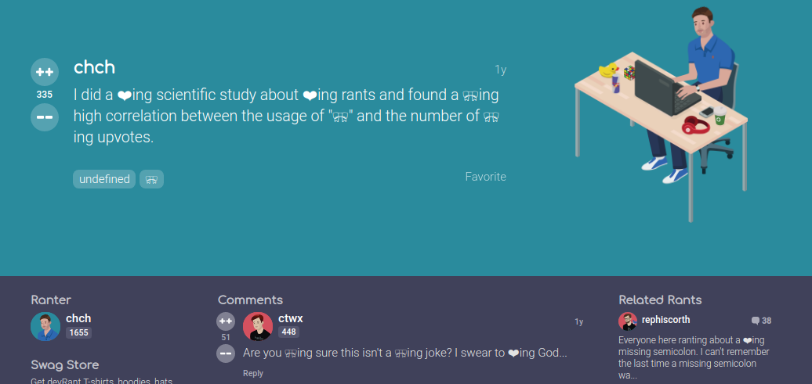

devrant swear remover

## Tampermonkey

Download tampermonkey:

- **Chrome:** https://chrome.google.com/webstore/detail/tampermonkey/dhdgffkkebhmkfjojejmpbldmpobfkfo
- **Firefox:** https://addons.mozilla.org/en-US/firefox/addon/tampermonkey/
- **Opera:** https://addons.opera.com/en/extensions/details/tampermonkey-beta/
- **Other:** https://tampermonkey.net/ (follow instructions there)

Then install the user-script here:
https://github.com/devTeaa/devrant-unswear/raw/master/unswear.user.js

You can edit the words and elements starting from line 16

```
let goodWords = ["❤️", "🎀"];
let badWords = ["..."];
let elementToWatch = ["..."];
```

Set the randomMode to false on line 14 if you want specific badWords to be replace with their goodWords
but the goodWords must have the same length as badWords


